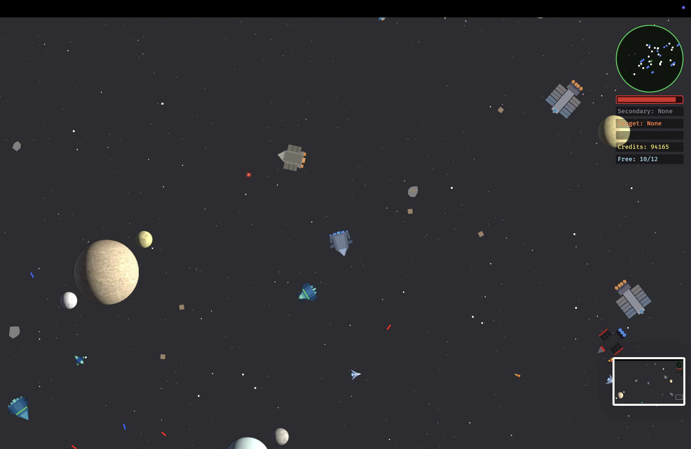

# Avian Space

An open-world space RPG built with [Bevy](https://bevyengine.org/) and [Avian2D](https://github.com/Jondolf/avian) physics, where AI ships are trained using reinforcement learning.



## Overview

Explore a galaxy of interconnected star systems as a pilot forging your own path. Trade commodities between planets, hunt bounties on wanted ships, mine asteroids for resources, or follow hand-crafted storylines that unlock as you progress. The universe is configured entirely through YAML files, making it straightforward to add new missions, ships, weapons, and star systems without touching code.

What sets Avian Space apart is its AI: other ships in the world are controlled by neural networks trained via behavioral cloning and proximal policy optimization (PPO), producing emergent, adaptive behavior rather than scripted routines.

## Features

- **Multiple career paths** -- Take on delivery contracts as a merchant, destroy targets as a bounty hunter, harvest asteroid fields as a miner, or mix and match as you see fit.
- **Story-driven and procedural missions** -- Hand-crafted mission chains with preconditions sit alongside parameterized templates that generate varied objectives dynamically.
- **Inter-system travel** -- Jump between star systems through hyperspace, each with its own planets, stations, and hazards.
- **Combat and weapons** -- Lasers, missiles, proton beams, space mines, and more, each with distinct behavior and sound effects.
- **Planet landing and trade** -- Dock at planets and stations to buy and sell commodities, pick up missions, and outfit your ship.
- **Data-driven configuration** -- Ships, weapons, star systems, missions, and items are all defined in YAML files under `assets/`.
- **RL-trained AI ships** -- NPC ships use neural network policies trained with behavioral cloning and PPO, powered by the [Burn](https://burn.dev/) ML framework.

## Running

Requires Rust. All commands should include `--features dev` for fast incremental builds during development.

```bash
# Play the game (default: behavioral cloning training mode)
cargo run --features dev

# Play with RL-trained AI (inference only, no training)
cargo run --features dev -- --inference

# Classic mode (rule-based AI, no neural networks)
cargo run --features dev -- --classic

# RL training mode
cargo run --features dev -- --rl-training

# Headless training (no renderer, faster)
cargo run --features dev -- --bc-training --headless

# Start fresh, ignoring saved checkpoints
cargo run --features dev -- --inference --fresh
```

## Adding Content

All game content lives in YAML files under [`assets/`](assets/):

| File | Purpose |
|------|---------|
| `star_systems.yaml` | Star systems, planets, and connections |
| `ships.yaml` | Ship definitions (stats, sprites, factions) |
| `weapons.yaml` | Weapon types and parameters |
| `missions.yaml` | Hand-crafted story missions |
| `mission_templates.yaml` | Parameterized templates for procedural missions |
| `outfitter_items.yaml` | Purchasable ship upgrades |

New storylines can be added by writing mission entries in `missions.yaml` with briefing text, objectives, rewards, and optional preconditions that gate progression.

## Testing

```bash
cargo test --features dev
```
